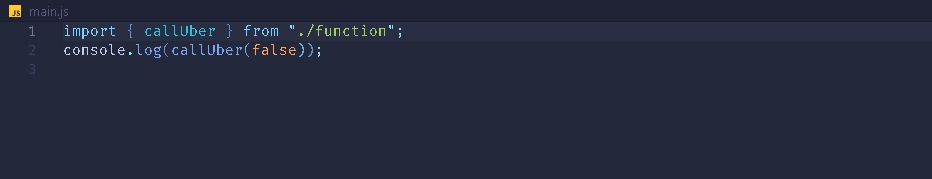

# JS Before React

## Nullish Coalescing Operator

When we use the || operator, that means an "or", we mean that we want a value or another like this;

```javascript
const age = 0;

document.body.innerText = "Your age is:" + age || "Not Informed";
```


Well, the problem in this example is that in vanilla JavaScript the || operator understands that 0 is the same as null, false, undefined, '', [], which it understand as a falsy value. Perhaps theres a brand new functionality that use a ?? operator that means the same of || but is more restrictive, assuming that 0 is still a value so would be like this;

```javascript
const age = 0;

document.body.innerText = "Your age is:" + age ?? "Not Informed";
```

in this scenario, the 0 is a valid number, returning 0 as a age, considering that 0 is a real number, not a falsy value.


## Objects and Destructuring

### Methods for Objects

When we are trying to take values from an object it might be a little complex, in matter of facts we have 3 methods to access the values of an object in the way we need.

```javascript
//here we have an object called user//
const user = {
  name: "Diego",
  age: 21,
  address: {
    street: "Puta que Pariu",
    cep: 12921 - 10,
  },
};
//we can access all this values with entries, keys or values//
document.getElementById("1").innerHTML = Object.entries(user);
document.getElementById("2").innerHTML = Object.values(user);
document.getElementById("3").innerHTML = Object.keys(user);
```


With the aim of access the information of this object use as a data, not a graphical returning, there are ways to unstructure this data with:

```javascript
JSON.stringify(Object.values(user));
```


Like this we get an array with values, unstrucuting it all, returning only the values of the keys from the object, whitout they're keys.

```javascript
JSON.stringify(Object.entries(user));
```


With the entries method it returns to us a vector with other vectors inside, very importante method, the best to return every data as we need.

### Destructuring

Reusing the object that we made we can learn something about reuse names for variables, when we need an address that the object already had that name we can unstructure our code, using less lines of codes, like this example:

```javascript
const { address } = user;
```

In the user object we have a key called address so in the beginning, when we are learning JS we can thing about doing something like:

```javascript
const address = user.address;
```

But is no need, the new sintax for ECMAScript already allow us to make that cool moviment.
Like if we have a lot of objects with diferent name for users for example user1 and user2.
doing this:

```javascript
function mostraIdade({ age }) {
  return age;
}
console.log(mostraIdade(user));
```

Would return the key value of the actual user called in fucntion. This makes part of something called short syntax like in this example:

```javascript
const name = 'Flávio';
const age = 21;
const user = {
  name,
  age;
}
```

In this case, the short syntax let us reuse code avoiding unnecessary lines.

## Rest operator

The rest operator allow us to take the rest of an array or keys of a variable, any of this cases can be used.
In this example we are trying to take only the first, not the second, the third and the rest of the numbers of the array to make a new array.

```javascript
const array = [1, 2, 3, 4, 5, 6, 7, 8];
// the new array with rest operator with be like this//
const [first, , third, ...rest] = array;
console.log({ first, third, rest });
```


## Optional Chaining

The operator ?. it is capable of make us avoid some if & elses, by putting them in front of the key of an object, is capable of ends there if the key doesn't exists.

```javascript
const user = {
  name: "Diego",
  age: 21,
  address: {
    street: "Puta que Pariu",
    cep: 12921 - 10,
    zip: {
      code: 123592 - 10,
      city: "Natal",
    },
  },
};

const key = "street";
console.log(user.address?.zip?.code ?? "Não informado");
```

That scenario is when we make a algorithm that needs to find something that maybe doesn't exists, so when the father of the key that is beeing searched is undefined, the chaining ends and the else return is activated.

## Array methods

### map

The map works like a forEach, but doing returning always the same length and propertys of the original array plus the algorithm in question.

```javascript
const array = [1, 2, 3, 4, 5, 6];
const newArray = array.map((item) => {
  return item * 2;
});
console.log(newArray);
```

In this case will always pass the original value of the numbers of the array multiplied by 2.

### filter

In this method we can only take a fill items that returns true to our condition, in the example above the algorithm filter the items that if divided by two return the rest of 0, in other words, a number that is even. So is like the map, passing through all the items of the array but in the new array only enters if respect the condition indicated.

```javascript
const array = [1, 2, 3, 4, 5, 6];
const newArray = array.filter((item) => item % 2 === 0);
console.log(newArray);
```

### every & some

These two methods are quite look a like, both return a boolean value, true or false, but in 'every' it returns true if every items of the array respects the condition, 'some' only needs to have one of the values to respect the condition.

```javascript
//every//
const array = [1, 2, 3, 4, 5, 6];
array.every(item => typeof === 'number')//true//
const array2 = [1, 2, 3, 4, 5, 6, 'batata']
array2.every(item => typeof === 'number')//false//
//some//
const array = [1, 2, 3, 4, 5, 6];
array.some(item => typeof === 'number')//true//
const array2 = [1, 2, 3, 4, 5, 6, 'batata']
array2.every(item => typeof === 'number')//true//
const array2 = [1, 2, 3, 4, 5, 6]
array2.every(item => typeof =/= 'number')//false//
```

### find & findIndex

The find method is responsable for take the first key value of the array that respects the condition, the findIndex does almost the same thing but only returns the index position of the item that respects the condition.

```javascript
const array = [1, 2, 3, 4, 5, 6];
array.find((item) => item % 2 === 0); //it returns the first value that respects the condition, in this case the first even number which is 2//
array.findIndex((item) => item % 2 === 0); //here just the position, which is 1//
```

### reduce(revisar)

The reduce method is the one who has the most quantities of parameters, is it possible to do a lot of things with it. The items are:

- A function
- Initial value
- Accumulator
- Item from the array

The reduce has the capability of accumulate numbers from an array, is the most complete method, we can pass the functions that we want to put in some new variable without changing the original array, in this case above we can see how is done a sum of number from an array.

```javascript
const array = [1, 2, 3, 4, 5];
const soma = array.reduce((acc, item) => {
  return acc + item;
});
console.log(soma); //returns 15 which is 1+2+3+4+5
```

## Template literals

In this example

```javascript
const age = 12;
const message = "You have " + age + " years";
console.log(message); //returns the sentece "You have 12 years"//
```

Besides this, we can use this syntax to have more options of dynamism.

```javascript
const age = 12;
const message = `You have  ${age} years`;
console.log(message); //returns the sentence "You have 12 years"//
```

For example if the age would be a null number, we can send a value to this case.

```javascript
const age = null;
const message = `You have ${age ?? "Not Informed"} years`;
console.log(message); //returns "You have Not Informed years"//
```

## Promisses & Async awaits

### then, catch & finally

When we are doing async requests, we need to let our application still running, so the promisses can do this in real time, while our browser already have read our js, our promisses take they're time to run, thats why it calls async awaits.

```javascript
console.log("requesting");

const aceppted = false;
const promise = new Promise((resolve, reject) => {
  if (aceppted) {
    return resolve("arrived");
  }
  return reject("cancelled"); //will return the rejected because the condition is not true//
});
console.log("pending");
promise
  .then((result) => console.log(result))
  .catch((error) => console.log(error))
  .finally((onfinally) => console.log("ended"));
```


In this example we can see how our application is still running but in the background we have a operation beeing done, when we do the promisse, it starts as a pending promisse, then with the ".then" method we show a result if it is sucessful, but in the case of not, it will returns a error with the ".catch" method, ".then" when is the condition is "resolve", else the "reject" with the ".catch" method as in the example, but always return a ".finally" in the end of the promisse.

## ES Modules

In the ECMAscript 6+, we can do something that is very used in react, the importation of functions from others archives to a main, sometimes we can write a code with function that we want to use somewhere else, importing in the begginning of the file makes that possible, exporting functions that we need in the somewhere else and importing in the file that is needed.

Exporting

Importing

